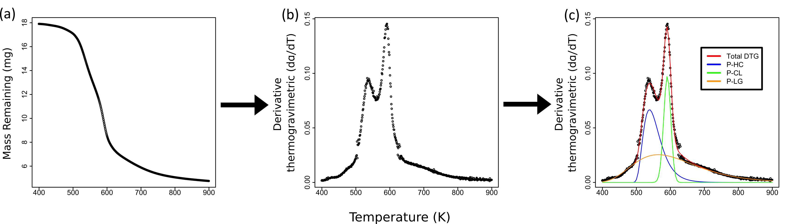

```{r knitr_options, eval=TRUE, echo=FALSE, warning=FALSE, message=FALSE}
# set up knitr options
knitr::opts_chunk$set(message = FALSE,
               warning = FALSE,
               fig.align = 'center',
               dev = c('png'),
               cache = TRUE,
               comment = NA)
```

```{r Library, echo=FALSE, message=FALSE, warning=FALSE}
library(deconvolve)
```

<hr>

## Functions
tga_process = processing of raw data to get derivatives
fs_function = Fraser-Suzuki function
fs_mixture = mixture function
deconvolve = run non-linear model
decon_plot = plot outputs
mass_fractions = calculate mass fractions of each pseudo-component


## Using deconvolve package

Traditional methods for calculation of lignocellulosic biomass involve wet chemistry methods that are both costly and involve potentially harmful chemicals. While thermogravimetric analysis (TGA) does not provide exact measurements of carbon components, it can be used to estimate mass fractions of dominant carbon forms. The following is a brief introduction to how to use measurements from TGA to estimate pseudo-components using the deconvolve package. This methodology has been tested on a range of plant litter, whose carbon content is expected to roughly partition into three dominant types: hemicellulose, cellulose, and lignin. It is not suitable for woody material. At this point, the functions contained in this package cannot be used to deconvolve mass decay into further components.

To start with, I'll show you a brief overview of what you can expect to do with this package, and then I'll go into some detail about how to use each function in the package. This work is still a work in progress! If you see any mistakes, or find that the code is not functioning well on your data, let me know at saras.windecker@gmail.com, or log a bug on github: http://www.github.com/smwindecker/deconvolve.

```{r echo = F, out.width= '650px', fig.align = "center", fig.cap="*Figure 1. Map of outputs of deconvolution of thermogravimetric curves: mass loss against temperature reflects the raw data we typically export from the TGA processing software (a.), derivative thermogravimetric rate against temperature (b.), and finally, the main output from this package, the deconvolved derivative thermogravimetric curves of each pseudo-component (c.).*"}

```


First I'll introduce a bit of theory, if you'd rather skip straight to the how-to, head to XXX in the sidebar.

The simplest way to use this package is to simply use the main two functions, `deconvolve()` and `mass_frac()` on data that is already formatted to model it and then extract mass fractions. There are also a few helper functions to get the data in the right format and plot the output. We will do a full worked example, starting with a big of background theory. 

We can see all the functions here: 
```{r}
ls('package:deconvolve')
```

<hr>

## Theory
using mixture model to estimate proportions of components, 
why fs? -- studies have found that it estimates well. good tie. flexible because has 4 parameters per curve. 
show equation 
then mixture part


$\frac{d\alpha}{dT}_{total} = \sum\limits_{i=1}^3 \frac{d\alpha}{dT}_{i}$
$\frac{d\alpha}{dT} = h\ exp\bigg\{-\frac{ln2}{s^2}\Big[ln\Big(1 + 2s \frac{T- p}{w}\Big)\Big]^2\bigg\}$


and then the initial mass to estimate mg/mg 
Include equation for that part

<hr>

## Preparing your data

Depending how your data is structured when it is exported from the TGA analysis software, you may need to do some pre-processing before it is ready to be modelled. The main function in this package is `deconvolve()`, which executes the three-part mixture model on DTG data. In order to execute this function, you must have the data prepared in DTG format, with enough space between temperature measurements. deconvolve has a function to help you do this: `tga_deriv()`. 

```{r}
library(devtools)
# document('../../deconvolve')
# install('../../deconvolve')
# library(deconvolve)
```

``` {r}
data(raw_data)
head(raw_data)
```

First step will be to confirm that your data contains the necessary components for the pre-processing function. We can see that we have mass loss and temperature data. Temperature data is in C, however, so first we will transform the column in K. 

```{r}
raw_data$temp_K <- raw_data$temp_C + 273
```

We are now ready to use `tga_process()`. ** note ** about the lower and upper inputs. It is generally agreed upon that the early stages of TGA measures reflect 

```{r}
munge_data <- tga_process(raw_data, 'temp_K', 'mass_loss', 18.9615, 400, 900)
head(munge_data)
```

<hr>

## Plot your data 

If our dataset contained many replicate measures per degree we can see that the function has shortened the dataset. We can see that we now have a column for the derivative mass loss rate. At this point we may want to plot this data. We can do so with the base R plot function. 

```{r}
par(mfrow=c(1,2)) 
plot(munge_data$temp_K, munge_data$mass_T, xlab = 'Temperature (K)', ylab = 'Mass Remaining (mg)')
plot(munge_data$temp_K, munge_data$deriv, xlab = 'Temperature (K)', ylab = 'DTG (mg/K)')
```

We can see that it has plotted both the mass loss against temperature and the derivative curve. The difference here is that the derivative curve places DTG on the y axis, displaying a change in rate. Every curve will look a little different, but you should see a few humps in your DTG curve. These correspond to the underlying mass loss curves of the three pseudo-components. 

<hr>

## deconvolve
The next step is to deconvolve the DTG curve. The function `deconvolve()` does so by modelling a three-part non-linear mixture model of Fraser-Suzuki functions. 

Temperature column must be named 'temp_K' (this is yucky)....

```{r}
fit <- deconvolve(munge_data, munge_data$temp_K, munge_data$deriv)
summary(fit)
```

So now that we've modeled our data, we may want to plot the output of the three curves, overlaid on top of the full mass curve. 

```{r}
decon_plot(munge_data$temp_K, munge_data$deriv, fit, 400, 900)
```


Take a look at your plot. Do the estimates seem reasonable? In many cases, the peak of pseudo-component 1, which corresponds to hemicellulose, occurs at the lowest temperature, followed by PC 2 (cellulose) and finally PC 3 (lignin). If your plot doesn't follow this pattern, can you think of an ecological explanation given you species/plant material type? 

The next thing you may want to do is calculate the mass fractions of your three components. This is not as simple as integrating under each curve, because that would just give us the mass fraction of the mass that was burnt off. We also need to take in to consideration the mass that was remaining at the end of thermal decay. 

```{r}
mass_frac <- mass_fractions(fit, 400, 900, 18.9615, munge_data$mass_loss)
mass_frac
```


### Single Parameter
The `single_param()` function is a useful little helper function that works at the back of many of the functions we have already looked at. You may want to use it yourself to extend or do other analyses. For example, to look an individual parameter estimates, we can do: 

```{r}
p1 <- single_param(fit, 'p', '1')
p2 <- single_param(fit, 'p', '2')
c(p1, p2)
```

You may also want to plot your own curves. You can do so by combining your chosen plotting system and `single_param()` to estimate individual parameter values for each of the 12 parameters, with the overall mixture model function `fs_mixture()`. 


